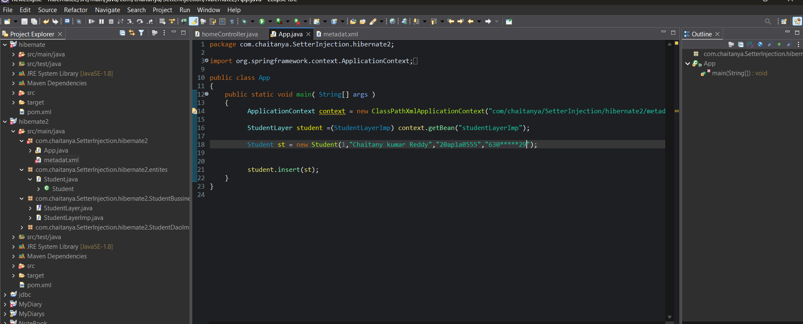
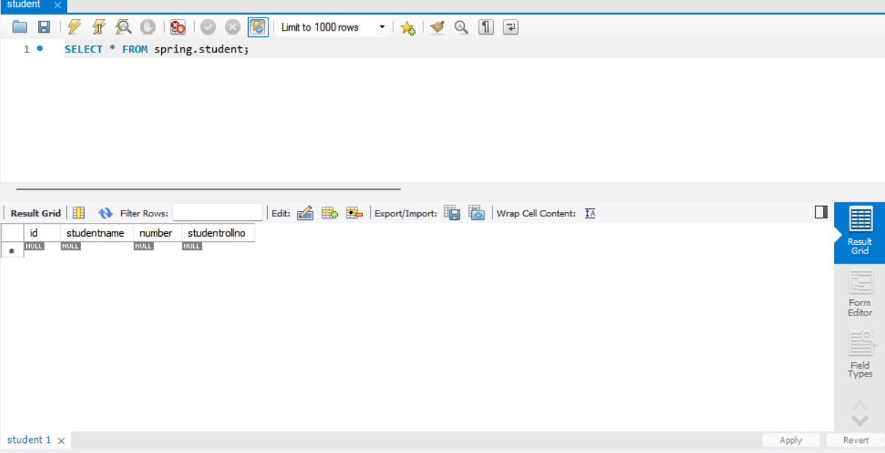
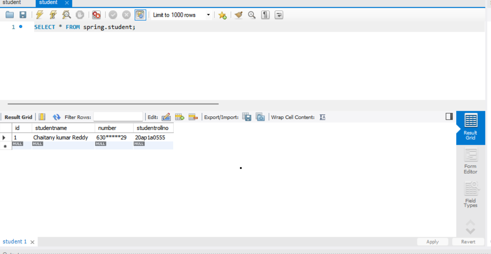
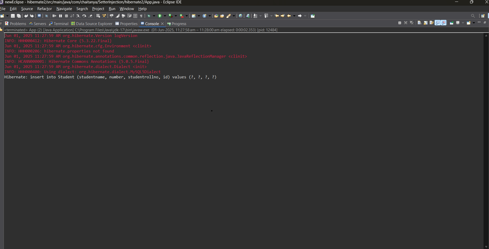

# Hibernate - MySQL CRUD Project

This project demonstrates basic CRUD operations using Hibernate and MySQL.

A simple Java-based project demonstrating basic CRUD (Create, Read, Update, Delete) operations using Hibernate ORM with a MySQL database. This project shows how to configure Hibernate, map Java classes to database tables, and perform database operations efficiently with annotations and hibernate.cfg.xml.

## Project Screenshots

### App Java  

### Database Empty  

### Displayed Details  

### Executed Hibernate Code  

